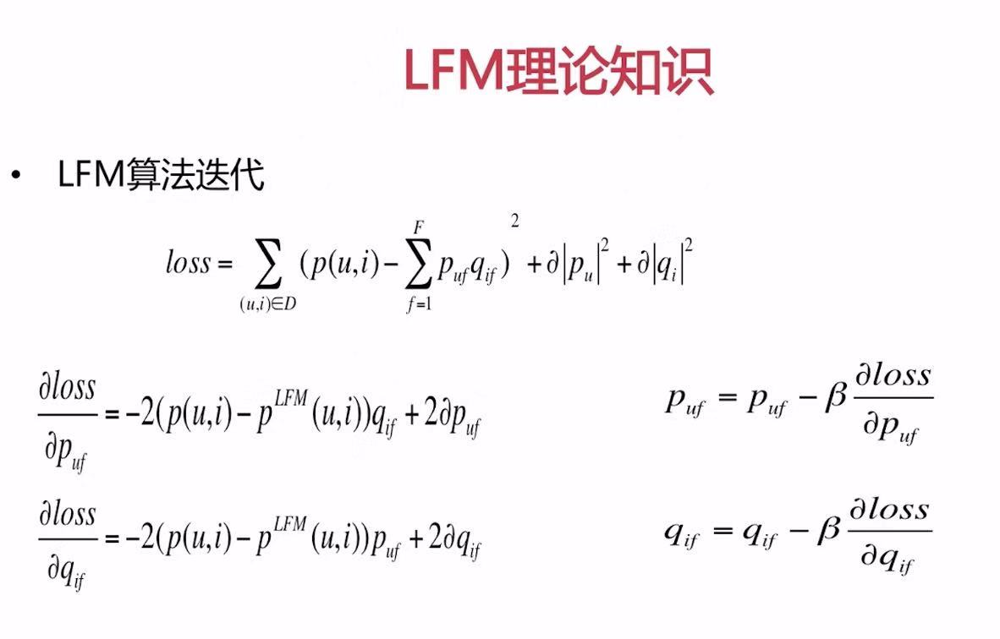
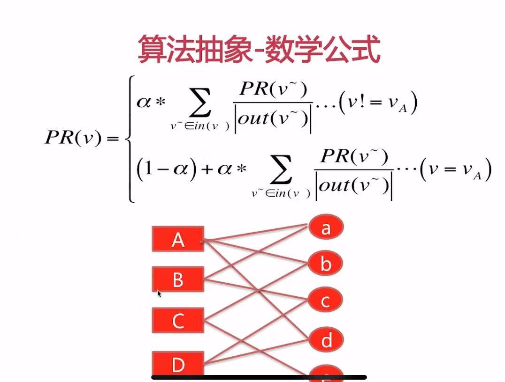
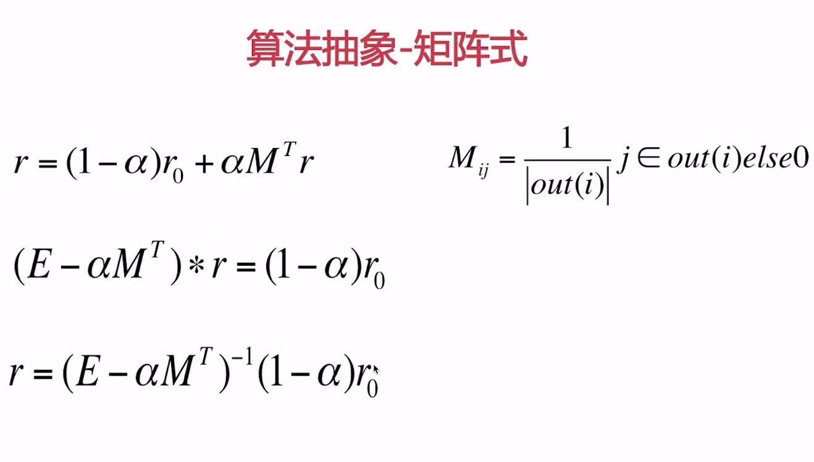

# Personal Recommendation Algorithm  学习笔记

# 一. 推荐 Recommendation

## 1. 综述
### 1.1 个性化推荐算法综述

课程大纲：
1. Recall 召回
    - FM
    - Graph-based
    - Content-based
    - Graph-embed
    - Item2Vec
2. Rank 排序
    - LR
    - GBDT
    - LR + GBDT
    - DNN 
3. Evaluate
    1. offline
        - AUC
        - Precise
        - Recall
        - RE Recom
        - Re Rank
    2. online
        - CTR
        - ViewTime
        - TotalRecomID
4. 环境
   - python, tensorflow, word2vec, xgboost

### 1.2 个性化召回算法综述

1. 个性化召回： 从item全集中选取一部分作为候选集
2. 个性化召回算法
    - 基于用户行为的
    - 基于 user profile 的
    - 基于隐语义的
3. 工业界个性化召回框架
   pass

## 2. LFM(latent factor model)

### 2.1 LFM 综述
1. LFM 算法： 
    根据 User Item 的矩阵 P, 求出user 和item 的向量表示
    
### 2.2 LFM 理论知识与公式推导


- P（u, i）: 代表用户 user 对 item 的关系矩阵（喜欢/点击为1， 否则为0, 或者是评分。）
- F ：user 和item 的向量维度， 隐特征个数 (10-32)
- 正则项系数 a （0.01-0.05）
- 学习率 b （0.01-0.05）

### 2.3 LFM code 实现
1. 数据集
    - recommendation/data/movies.txt
    - recommendation/data/ratings.txt
    
2. code
    - recommendation/LFM

## 3. Personal Rnak 
> [参考连接](https://blog.csdn.net/thormas1996/article/details/89479779)
1. 概念： 图， 顶点， 边， 二分图
2. 图中顶点的相关度主要取决与以下因素： 
    - 两个顶点之间路径数 
    - 两个顶点之间路径长度 
    - 两个顶点之间路径经过的顶点
    
3. 而相关性高的顶点一般有如下特性： 
    - 两个顶点有很多路径相连 
    - 连接两个顶点之间的路径长度比较短 
    - 连接两个顶点之间的路径不会经过出度较大的顶点
    
4. 迭代形式公式 

    - in(v) 表示 指向 v 的节点的集合
    - out(v) 表示 v 指向的节点的结合, |out(v)|出度
    - vA 表示初始点，  
    ```
      其中 PR(A) = （1-alpha）*(len(out(A))) + alpha*()
                = 3*(a-alpha) + 1/2 * alpha * rank[a] +  1/2 * alpha * rank[b] + 1/2 * alpha * rank[d]
    ```
5. Personal Rank 矩阵形式
     
    - r: （m+n）* 1 的列向量， m user 个数， n item 个数
    - r0: 除了被推荐的user 对应的行值为1， 其余为0
    - M: 表示转移概率矩阵，顶点之间有连接边的为，出度的倒数， 否则为0
    

## 4. item2Vec

大体思路：
  - 用户行为文件中，过滤出user 喜爱的item 
  - 利用每一行item, 组成语料
  - 输入word2vec ，训练每个item , 得到itemvec
  - 对用户喜欢的item, 计算其他item与喜欢的item 的预先相似度，排序，推荐给用户

## 5. ContentBased： 基于内容的推荐
1. Item Profile ： 物品的刻画
    - Topic Finding: 话题发掘
    - Genre Classify : 类型的划分
2. User Profile： 用户的刻画
    - Genre / Topic： 类型，话题
    - Time decay: 时间衰减
3. Online Recommendation
    - find top k Genre/topic
    - get the best n item from fixed Genre /topic

code 思路：
1. 工具函数
    - 获得item的平均得分字典：{item_id: avg_score}
    - 获得item的分类与权重     {item_id: {cate: ration}}
    - 获得每个分类下的item_id （上述字典的倒排， 再对value按照平均得分倒序排列）{cate:[itemid, ...itemdid]}
   
2. 获得用户喜爱的topk分类， 并把喜爱类型得分归一化倒序排列
    - 遍历用户行为文件ratings.txt 对于用户行为过的item， 大于4分表示喜欢
        - 遍历每一个用户喜欢的item
            - 遍历每一个喜欢的item中的分类cate
                - 计算用户对种类的得分： 用户评分 * 时间得分（时间衰减） * 该种类在item下的权重
        - 按照用户对分类的得分倒序排列
        - 对每一个用户，按照用户喜爱的分类[topk], 并把喜爱的类型得分归一化
3. 推荐
    - 将用户刻画存入到k-v中
    - 将item的倒排存入到搜索引擎中
    - 线上推荐过程， 是实时的，分别请求kv 和搜索引擎

## 6. 个性化召回算法的总结
1. 总结
    - ItemCF
    - UserCF
    - LFM: user 与 item  的隐向量
    - Personal Rank: PR值 
    - Content Based: item 刻画+ user 刻画
    - item2vec 基于神经网络的
    
2. 召回Match - 排序Rank - 策略调整 Strategy ==> Web Api
    - 召回阶段的多个算法并存
    - 召回决定推荐效果的天花板
    - 排序决定逼近天花板的程度
3. 评价
    - 离线评价准入： 评测新增算法的推荐结果在测试集上的表现
        
    - 在线评价收益
        - 定义指标： 
            - 信息流场景： 点击率， 平均阅读时长
            - 电商： 转化率，总交易额度
        - 生产环境 abtest
            - 以划分userid 尾号的形式
            
# 二. 排序  Rank   
## 1. 学习排序 Learn to Rank

框架：  粗排序 PreRank -> 主排序 Rank -> 重排序 ReRank

1. 主排序的分类
    - 单一的浅层模型（相对于深度学习模型而言）： 逻辑回归， FM
    - 浅层模型的组合： LR + GBDT
    - 深度学习模型
2. 工业界 Rank 架构
    - Recall Items ==> Rank 打分框架
    - Rank 打分框架：
        - item user  feature extractor : 特征提取
        - Rank Server 
    
## 2.逻辑回归模型   Logistic Regression
 1. 点击率预估 与 分类模型
 2. 正则化：
    - L1 正则化： loss = loss + a*sum(|wi|)
    - L2 正则化:  loss = loss + a*sum(|wi|^2)
 3. 样本选择与特征选择
    样本选择规则：
        正负样本采样比例： 